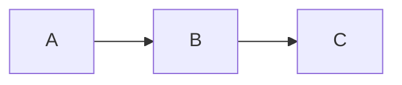

# Slidev Implementation Notes

Practical guidance for building Slidev decks, based on prior implementations.

## Mermaid Diagrams

Use `{scale: 0.65}` to `{scale: 0.85}` to fit diagrams on slides without overflow:

```markdown


Keep diagrams simple -- `flowchart LR` and `flowchart TD` are reliable in both SPA and PDF export. Advanced features (nested subgraphs, click events) may not render in PDF.

If `slidev export` shows "An error occurred on this slide" but `slidev build` works fine, the issue is Playwright/chromium configuration (common on NixOS), not diagram syntax.

## PDF Export Checklist

Before marking a slides task as complete, verify:

1. `pnpm run build` exits 0 (SPA build)
2. `pnpm run export` exits 0 (PDF via Playwright)
3. PDF has the expected page count (one per `---` separator)
4. Mermaid diagrams render (no red error messages)
5. Vue components render (no blank areas)
6. Footer text is readable and separated from Slidev's built-in footer bar
7. No content overflows slide boundaries
