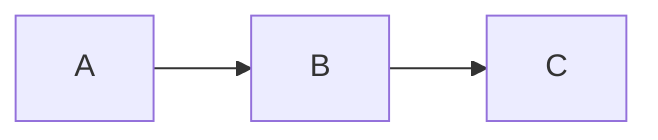

# Slidev Implementation Notes

Practical guidance for building Slidev decks, based on prior implementations.

## Mermaid Diagrams

Use `{scale: 0.65}` to `{scale: 0.85}` to fit diagrams on slides without overflow:

```markdown


Keep diagrams simple -- `flowchart LR` and `flowchart TD` are reliable in both SPA and PDF export. Advanced features (nested subgraphs, click events) may not render in PDF.

If `slidev export` shows "An error occurred on this slide" but `slidev build` works fine, the issue is Playwright/chromium configuration (common on NixOS), not diagram syntax.

## Required Final Phase: Playwright Verification

Every Slidev implementation plan MUST include a final phase that uses Playwright to verify every slide renders without errors. This phase runs after all slide content is authored and before the task is marked complete.

### Phase Template

The planner should include this as the last phase (after all content authoring and build phases):

```
### Phase N: Playwright Slide Verification [NOT STARTED]

**Goal**: Verify every slide renders without errors using Playwright,
fix any broken slides, and export the final PDF.

**Tasks**:
- [ ] Copy `talk/templates/playwright-verify.mjs` to `scripts/verify-slides.mjs`
- [ ] Run `node scripts/verify-slides.mjs --screenshots` to test every
      slide against the dev server
- [ ] Fix any slides that report VISIBLE ERROR or console errors
- [ ] Re-run verification until all slides pass (exit code 0)
- [ ] Run `pnpm run export` to produce the final PDF
- [ ] Verify PDF page count matches expected slide count

**Timing**: 0.5-1 hour

**Depends on**: all content authoring phases

**Verification**:
- `verify-slides.mjs` exits 0 (all slides pass)
- `pnpm run export` exits 0
- PDF page count matches slide count
- No "An error occurred on this slide" on any page
```

The template script is at `.claude/context/project/present/talk/templates/playwright-verify.mjs`. Copy it into the project's `scripts/` directory during this phase.

### What the Script Checks

For each slide, the script:
1. Navigates to `localhost:{port}/{slideNumber}` via Playwright chromium
2. Waits for network idle + 2 seconds (for Mermaid rendering)
3. Checks for visible "An error occurred on this slide" text
4. Captures any `pageerror` console errors
5. Checks text content length (catches blank/empty slides)
6. Optionally takes a screenshot (`--screenshots` flag)

Exit code 0 means all slides passed. Exit code 1 means at least one slide failed.

### Fixing Common Errors

When slides fail verification:
- **Vue component error**: check that all referenced components exist in `components/` and have valid `<template>` blocks
- **Mermaid parse error**: simplify the diagram syntax, check for unescaped special characters
- **Blank slide**: check the `---` separator placement and layout name spelling
- **Console error about undefined property**: check that component props match what the slide passes
