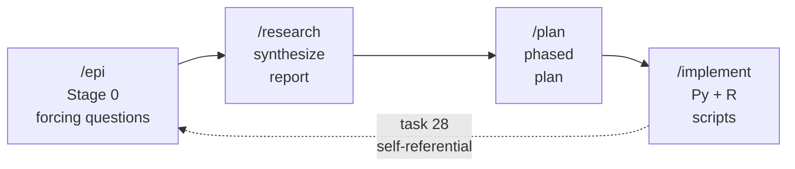
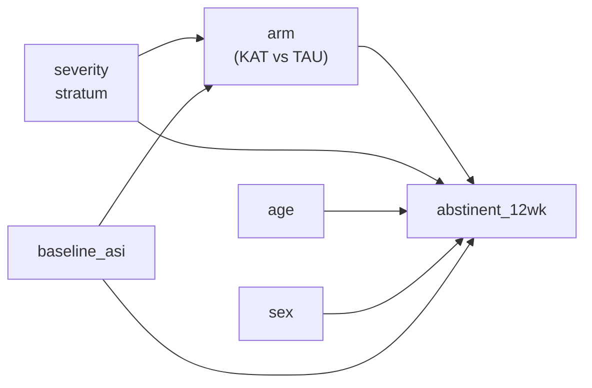

# The /epi Workflow

## A Synthetic RCT Walkthrough

  Synthetic data throughout. Not a clinical finding.

  Re-verified 2026-04-10 (task 28) -- byte-identical across an environment upgrade

  Synthetic data -- not a clinical finding

<!--
Speaker notes (Slide 1, ~70 seconds):
Welcome. Before any content, one disclaimer that will repeat on five slides:
every number in this talk comes from a synthetic data-generating process.
The study is a demo -- a toy RCT -- built to showcase a Claude Code workflow
called /epi, not to report clinical evidence. The point is the tooling, the
reproducibility, and the pre-specified methods. Say it once here; I'll
remind you on slides 7, 9, 10, and 13 where the numbers get loudest.
Date stamp: re-verified 2026-04-10 under task 28 after an R stack upgrade.
-->

---
layout: default
---

# Motivation: The Scaffolding Tax

Before a single CONSORT table is written, a methods team typically spends a
week on **scaffolding**:

- Draft an analysis plan, argue about estimand, re-draft.
- Spin up an R project, fight `renv`, install half of tidyverse.
- Wire together data generation, cleaning, merging, analysis, sensitivity.
- Hand-author a CONSORT report from bullet-point notes.
- Try to reproduce it six months later. Fail. Blame nobody.

**Claim**: Most of that week is not thinking -- it is scaffolding.

**Ask**: What if four commands could scaffold the whole thing, preserving
pre-specification, sensitivity rigor, and byte-level reproducibility?

<!--
Speaker notes (Slide 2, ~70 seconds):
This talk is not about statistics. It is about the tax we pay before
statistics. The week of scaffolding that eats motivation, buries
pre-specification, and makes six-month reproducibility a fiction. I want to
show you what a workflow looks like when that tax is near zero, using a
four-command Claude Code loop on a synthetic RCT. Keep the word
"scaffolding" in your head -- we come back to it on the final slide.
-->

---
layout: default
---

# The Four-Command Workflow

- **/epi** -- ten forcing questions (PICO, estimand, sensitivity suite, ...).
- **/research** -- synthesize a research report from the answers.
- **/plan** -- turn it into a phased, verifiable implementation plan.
- **/implement** -- generate Python + R + Quarto source, run end-to-end.

One prompt in. Full analysis pipeline, CONSORT report, and sensitivity
suite out. Task 28 ran the same loop on *itself*.

<!--
Speaker notes (Slide 3, ~70 seconds):
Four commands. /epi asks ten forcing questions -- these are the feature,
not a chore, and I'll come back to that on the next slide. /research
writes the literature + methods report. /plan phases it into verifiable
chunks. /implement writes the Python and R and Quarto source and runs
them. The dotted feedback arrow is the self-referential bit: when task 28
had to re-run the same pipeline under a new R stack, it fed the re-run
itself through the same loop. We'll see the receipts on slide 12.
-->

---
layout: default
---

# `/epi` Stage 0: Forcing Questions Are the Feature

Before any code, `/epi` asks ten questions the user *cannot* skip:

| # | Forcing question (abbreviated) |
|---|---|
| 1 | Population, intervention, comparator, outcome (PICO) |
| 2 | Primary estimand and target of inference |
| 3 | Pre-specified primary model (covariates, link, transformation) |
| 4 | Sensitivity suite -- what alternatives *must* run? |
| 5 | Missing data strategy (MCAR/MAR/MNAR assumption, MICE m, seeds) |
| 6 | CONSORT reporting requirements |
| 7 | Randomization and stratification |
| 8 | Analysis hints (tipping-point, per-protocol, interaction tests) |
| 9 | Data provenance and seeds |
| 10 | Reproducibility contract (what must be byte-identical) |

<strong>Self-referential footer:</strong> Task 28 ran this exact loop on the
pipeline *re-run*. The extension regenerated its own re-run plan and landed
byte-identical results. Receipts on slide 12.

<!--
Speaker notes (Slide 4, ~70 seconds):
These questions are the feature. Everything downstream -- the CONSORT
report, the MICE sensitivity, the tipping-point analysis -- exists because
a forcing question asked for it at Stage 0. Pre-specification is not a
document; it is a side-effect of answering questions you cannot skip. And
the self-referential point: when task 28 re-ran this whole pipeline on a
fresh R stack, the re-run itself went through /epi -> /research -> /plan
-> /implement. The workflow regenerated its own re-run. I will show you
the receipts on slide 12.
-->

---
layout: default
---

# Study Design (PICO + DAG)

**Population**: adults with moderate-to-severe substance use disorder
(simulated, N = 200).
**Intervention**: "KAT" (a synthetic behavioral arm).
**Comparator**: "TAU" (treatment as usual).
**Outcome**: 12-week abstinence (binary); time-to-relapse (survival).
**Estimand**: adjusted odds ratio of abstinence, KAT vs TAU.

Pre-specified model: `abstinent_12wk ~ arm + severity_stratum + age + sex + baseline_asi`.

<!--
Speaker notes (Slide 5, ~70 seconds):
Here is the PICO and the DAG that fell out of the forcing questions.
Severity stratum is both a confounder and a randomization stratum;
baseline ASI captures dependence severity. The model is pre-specified:
arm plus four covariates, logistic link, complete-case primary with a
pre-declared sensitivity suite. No decisions are being made here now;
every choice on this slide was locked at Stage 0.
-->

---
layout: default
---

# Pipeline Anatomy: Python <-> R <-> Quarto Handoff

| # | Script | Lang | Input | Output |
|---|---|---|---|---|
| 01 | `01_generate_data.py` | <LangBadge lang="py" /> | seeds | `data/raw/participants.csv` |
| 02 | `02_generate_outcomes.py` | <LangBadge lang="py" /> | participants | `data/raw/outcomes.csv`, `adverse_events.csv` |
| 03 | `03_merge_data.R` | <LangBadge lang="r" /> | raw CSVs | `data/derived/analytic.csv` |
| 04 | `04_primary_analysis.R` | <LangBadge lang="r" /> | analytic | `primary_results.txt`, `.rds` models |
| 05 | `05_sensitivity.R` | <LangBadge lang="r" /> | analytic | `sensitivity_results.txt`, `sensitivity_mice.txt`, `cox_results.txt` |
| 06 | `quarto render` | <LangBadge lang="quarto" /> | `consort_report.qmd` | `rendered/consort_report.html` |

**Callout**: CSV is the lingua franca; Quarto is the report substrate.

<!--
Speaker notes (Slide 6, ~60 seconds -- trimmed from 70 per report 02):
Six steps. Python generates, R analyzes, Quarto renders. CSV is the
lingua franca between languages; Quarto is the report substrate. Step 6
-- new in the task-28 enriched re-run -- is a Quarto render producing a
publication-quality HTML CONSORT report with dynamic R chunks reading
the saved .rds models. Exit zero, under two seconds. Trim this slide if
running long; slide 12 does a lot of the heavy lifting for step 6.
-->

---
layout: caveat
---

# The Data-Generating Process (Honesty Slide)

Every number downstream comes from this DGP:

- **Participants**: N = 200; age ~ truncated normal; sex ~ Bernoulli.
- **Severity stratum**: ordinal 1-3 with probs (0.3, 0.45, 0.25).
- **Baseline ASI**: Beta-distributed, scaled 0-1.
- **Treatment assignment**: stratified 1:1 on severity.
- **Outcome (12-week abstinence)**:

  `logit(P) = -0.9 + 1.2 * arm_KAT - 0.4 * severity - 0.5 * asi + noise`

- **Time-to-relapse**: Weibull, shape 1.3, scale function of arm + severity.
- **Missingness**: MAR on outcome ~ severity, ~15% missing.
- **Seed**: 20260410 (deterministic, reproducible).

**Every finding you will see is a property of these parameters** -- not of
any clinical population, institution, or therapy.

<!--
Speaker notes (Slide 7, ~70 seconds):
Honesty slide. Before the big OR, this is the DGP. The effect you are
about to see -- OR ~ 3.3 -- is a property of the +1.2 coefficient in the
logit, plus MAR missingness, plus a fixed seed. Nothing more. If a
clinician comes up afterward excited about KAT, point them back to this
slide. Amber banner stays up.
-->
