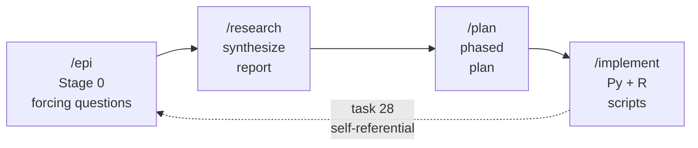
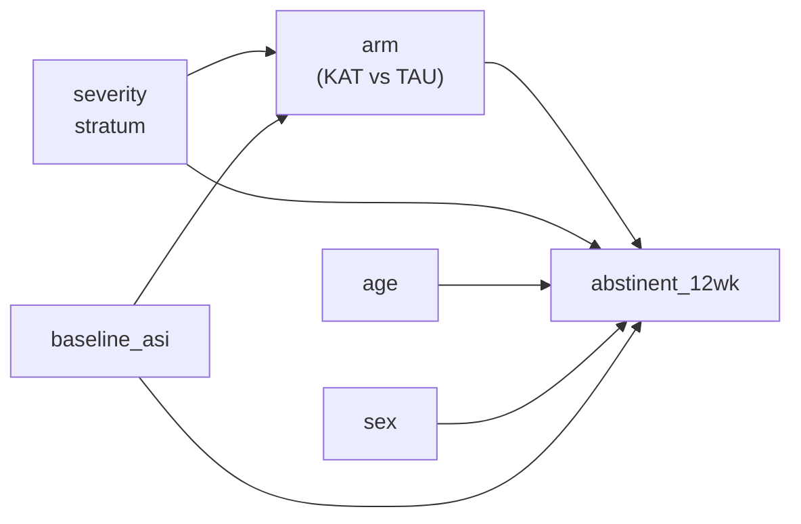
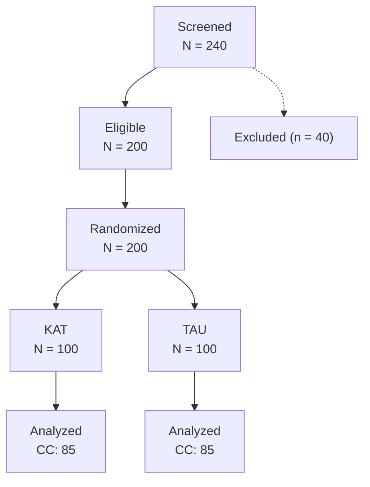

# The /epi Workflow

## A Synthetic RCT Walkthrough

<div class="synthetic-strap" style="margin-top: 2rem;">
  Synthetic data throughout. Not a clinical finding.
</div>

<div style="margin-top: 2.5rem; font-size: 0.9rem; color: #6b7280;">
  Re-verified 2026-04-10 (task 28) -- byte-identical across an environment upgrade
</div>

<div class="caveat-banner" style="margin-top: 2.5rem;">
  Synthetic data -- not a clinical finding
</div>

<!--
Speaker notes (Slide 1, ~70 seconds):
Welcome. Before any content, one disclaimer that will repeat on five slides:
every number in this talk comes from a synthetic data-generating process.
The study is a demo -- a toy RCT -- built to showcase a Claude Code workflow
called /epi, not to report clinical evidence. The point is the tooling, the
reproducibility, and the pre-specified methods. Say it once here; I'll
remind you on slides 7, 9, 10, and 13 where the numbers get loudest.
Date stamp: re-verified 2026-04-10 under task 28 after an R stack upgrade.
-->

---
layout: default
---

# Motivation: The Scaffolding Tax

Before a single CONSORT table is written, a methods team typically spends a
week on **scaffolding**:

- Draft an analysis plan, argue about estimand, re-draft.
- Spin up an R project, fight `renv`, install half of tidyverse.
- Wire together data generation, cleaning, merging, analysis, sensitivity.
- Hand-author a CONSORT report from bullet-point notes.
- Try to reproduce it six months later. Fail. Blame nobody.

**Claim**: Most of that week is not thinking -- it is scaffolding.

**Ask**: What if four commands could scaffold the whole thing, preserving
pre-specification, sensitivity rigor, and byte-level reproducibility?

<!--
Speaker notes (Slide 2, ~70 seconds):
This talk is not about statistics. It is about the tax we pay before
statistics. The week of scaffolding that eats motivation, buries
pre-specification, and makes six-month reproducibility a fiction. I want to
show you what a workflow looks like when that tax is near zero, using a
four-command Claude Code loop on a synthetic RCT. Keep the word
"scaffolding" in your head -- we come back to it on the final slide.
-->

---
layout: default
---

# The Four-Command Workflow



- **/epi** -- ten forcing questions (PICO, estimand, sensitivity suite, ...).
- **/research** -- synthesize a research report from the answers.
- **/plan** -- turn it into a phased, verifiable implementation plan.
- **/implement** -- generate Python + R + Quarto source, run end-to-end.

One prompt in. Full analysis pipeline, CONSORT report, and sensitivity
suite out. Task 28 ran the same loop on *itself*.

<!--
Speaker notes (Slide 3, ~70 seconds):
Four commands. /epi asks ten forcing questions -- these are the feature,
not a chore, and I'll come back to that on the next slide. /research
writes the literature + methods report. /plan phases it into verifiable
chunks. /implement writes the Python and R and Quarto source and runs
them. The dotted feedback arrow is the self-referential bit: when task 28
had to re-run the same pipeline under a new R stack, it fed the re-run
itself through the same loop. We'll see the receipts on slide 12.
-->

---
layout: default
---

# `/epi` Stage 0: Forcing Questions Are the Feature

Before any code, `/epi` asks ten questions the user *cannot* skip:

| # | Forcing question (abbreviated) |
|---|---|
| 1 | Population, intervention, comparator, outcome (PICO) |
| 2 | Primary estimand and target of inference |
| 3 | Pre-specified primary model (covariates, link, transformation) |
| 4 | Sensitivity suite -- what alternatives *must* run? |
| 5 | Missing data strategy (MCAR/MAR/MNAR assumption, MICE m, seeds) |
| 6 | CONSORT reporting requirements |
| 7 | Randomization and stratification |
| 8 | Analysis hints (tipping-point, per-protocol, interaction tests) |
| 9 | Data provenance and seeds |
| 10 | Reproducibility contract (what must be byte-identical) |

<div style="margin-top: 1rem; padding: 0.5rem 0.75rem; background: #ebf0f9; border-left: 3px solid #3b5998; font-size: 0.85rem;">
<strong>Self-referential footer:</strong> Task 28 ran this exact loop on the
pipeline *re-run*. The extension regenerated its own re-run plan and landed
byte-identical results. Receipts on slide 12.
</div>

<!--
Speaker notes (Slide 4, ~70 seconds):
These questions are the feature. Everything downstream -- the CONSORT
report, the MICE sensitivity, the tipping-point analysis -- exists because
a forcing question asked for it at Stage 0. Pre-specification is not a
document; it is a side-effect of answering questions you cannot skip. And
the self-referential point: when task 28 re-ran this whole pipeline on a
fresh R stack, the re-run itself went through /epi -> /research -> /plan
-> /implement. The workflow regenerated its own re-run. I will show you
the receipts on slide 12.
-->

---
layout: default
---

# Study Design (PICO + DAG)

**Population**: adults with moderate-to-severe substance use disorder
(simulated, N = 200).
**Intervention**: "KAT" (a synthetic behavioral arm).
**Comparator**: "TAU" (treatment as usual).
**Outcome**: 12-week abstinence (binary); time-to-relapse (survival).
**Estimand**: adjusted odds ratio of abstinence, KAT vs TAU.



Pre-specified model: `abstinent_12wk ~ arm + severity_stratum + age + sex + baseline_asi`.

<!--
Speaker notes (Slide 5, ~70 seconds):
Here is the PICO and the DAG that fell out of the forcing questions.
Severity stratum is both a confounder and a randomization stratum;
baseline ASI captures dependence severity. The model is pre-specified:
arm plus four covariates, logistic link, complete-case primary with a
pre-declared sensitivity suite. No decisions are being made here now;
every choice on this slide was locked at Stage 0.
-->

---
layout: default
---

# Pipeline Anatomy: Python <-> R <-> Quarto Handoff

<div class="data-table-container" style="font-size: 0.85rem;">

| # | Script | Lang | Input | Output |
|---|---|---|---|---|
| 01 | `01_generate_data.py` | <LangBadge lang="py" /> | seeds | `data/raw/participants.csv` |
| 02 | `02_generate_outcomes.py` | <LangBadge lang="py" /> | participants | `data/raw/outcomes.csv`, `adverse_events.csv` |
| 03 | `03_merge_data.R` | <LangBadge lang="r" /> | raw CSVs | `data/derived/analytic.csv` |
| 04 | `04_primary_analysis.R` | <LangBadge lang="r" /> | analytic | `primary_results.txt`, `.rds` models |
| 05 | `05_sensitivity.R` | <LangBadge lang="r" /> | analytic | `sensitivity_results.txt`, `sensitivity_mice.txt`, `cox_results.txt` |
| 06 | `quarto render` | <LangBadge lang="quarto" /> | `consort_report.qmd` | `rendered/consort_report.html` |

</div>

**Callout**: CSV is the lingua franca; Quarto is the report substrate.

<!--
Speaker notes (Slide 6, ~60 seconds -- trimmed from 70 per report 02):
Six steps. Python generates, R analyzes, Quarto renders. CSV is the
lingua franca between languages; Quarto is the report substrate. Step 6
-- new in the task-28 enriched re-run -- is a Quarto render producing a
publication-quality HTML CONSORT report with dynamic R chunks reading
the saved .rds models. Exit zero, under two seconds. Trim this slide if
running long; slide 12 does a lot of the heavy lifting for step 6.
-->

---
layout: caveat
---

# The Data-Generating Process (Honesty Slide)

Every number downstream comes from this DGP:

- **Participants**: N = 200; age ~ truncated normal; sex ~ Bernoulli.
- **Severity stratum**: ordinal 1-3 with probs (0.3, 0.45, 0.25).
- **Baseline ASI**: Beta-distributed, scaled 0-1.
- **Treatment assignment**: stratified 1:1 on severity.
- **Outcome (12-week abstinence)**:

  `logit(P) = -0.9 + 1.2 * arm_KAT - 0.4 * severity - 0.5 * asi + noise`

- **Time-to-relapse**: Weibull, shape 1.3, scale function of arm + severity.
- **Missingness**: MAR on outcome ~ severity, ~15% missing.
- **Seed**: 20260410 (deterministic, reproducible).

**Every finding you will see is a property of these parameters** -- not of
any clinical population, institution, or therapy.

<!--
Speaker notes (Slide 7, ~70 seconds):
Honesty slide. Before the big OR, this is the DGP. The effect you are
about to see -- OR ~ 3.3 -- is a property of the +1.2 coefficient in the
logit, plus MAR missingness, plus a fixed seed. Nothing more. If a
clinician comes up afterward excited about KAT, point them back to this
slide. Amber banner stays up.
-->

---
layout: default
---

# CONSORT Flow & Table 1



<div style="margin-top: 1rem; font-size: 0.85rem;">
  <strong>Table 1 footnote:</strong> Rendered via Quarto from
  <code>consort_report.qmd</code>. <code>gtsummary::tbl_summary</code>
  output included; base-R aggregate retained as fallback anchor.
</div>

<div style="position: absolute; right: 2rem; bottom: 3.5rem; border: 1px solid #d1d5db; border-radius: 4px; padding: 0.4rem; background: #f8fafc; font-size: 0.7rem; max-width: 10rem;">
  <a href="/assets/consort/consort_report.html" target="_blank">consort_report.html</a><br/>
  <em>Live document -- dynamic R chunks read .rds models</em>
</div>

<!--
Speaker notes (Slide 8, ~70 seconds):
Standard CONSORT flow: 240 screened, 200 randomized 1:1 stratified by
severity, 85 per arm analyzed complete-case. Table 1 footnote notes the
new Quarto render -- that thumbnail bottom-right links to the live
HTML report with dynamic R chunks reading the saved .rds models. The
base-R aggregate that ran under the hostile environment is retained as
a fallback; nothing gets deleted when better tooling lands.
-->

---
layout: caveat
---

# Primary Result -- Adjusted Logistic Regression

<div style="display: flex; flex-direction: column; align-items: center; margin-top: 1rem;">

  <div style="font-size: 3.5rem; font-weight: 700; color: #1e40af; font-family: Georgia, serif;">
    OR = 3.29
  </div>
  <div style="font-size: 1.2rem; color: #374151; margin-top: 0.5rem;">
    95% CI: 1.57 -- 6.89
  </div>
  <div style="font-size: 1rem; color: #dc2626; margin-top: 0.25rem;">
    p = 0.0016
  </div>

  <div style="margin-top: 1.5rem; font-size: 0.8rem; color: #6b7280; max-width: 36rem; text-align: center; border-top: 1px dotted #d1d5db; padding-top: 0.5rem;">
    Re-asserted across stack upgrade (task 28, 2026-04-10): byte-identical.
    <code>broom::tidy</code> profile-likelihood CI 1.595 -- 7.047 agrees to
    4 significant figures.
  </div>

</div>

<!--
Speaker notes (Slide 9, ~70 seconds):
This is the headline. Adjusted odds ratio of 12-week abstinence,
KAT vs TAU, complete-case primary: 3.29, 95% CI 1.57 to 6.89, p = 0.0016.
The small strip at the bottom is the new thing since the last time I
gave this talk: this number survived an environment upgrade. Same seed,
same scripts, different R stack -- diff minus q reports IDENTICAL and
SHA256 hashes match. That is not a rerun; that is a reproduction. Profile
likelihood CI from broom::tidy agrees to four significant figures.
Amber banner up. Synthetic.
-->

---
layout: caveat
---

# Cox Now Runs -- Graceful Degradation, Retired

<CodeDiff beforeTitle="Before (hostile environment)" afterTitle="After (task 28, upgraded stack)" beforeLang="base R" afterLang="survival::coxph">
  <template #before>

  `library(survival)` unavailable.

  Hand-written Mantel-Cox log-rank in
  ~20 lines of base R, plus a
  Gamma-family GLM surrogate.

  Result:

  - log-rank chi^2 = 26.5, p ~ 0
  - exp-GLM HR ~ 0.61

  Graceful degradation.

  </template>
  <template #after>

  ```r
  library(survival)
  fit <- coxph(
    Surv(days_to_use, event) ~ arm +
      severity_stratum + age +
      sex + baseline_asi,
    data = dat)
  cox.zph(fit)   # GLOBAL p = 0.55
  ```

  **HR = 0.426** (95% CI 0.311 -- 0.583, p < 1e-5)

  KM medians: TAU **25.4 d**, KAT **40.5 d**

  </template>
</CodeDiff>

<div style="margin-top: 0.75rem; font-size: 0.85rem; font-style: italic; color: #374151; text-align: center;">
  Graceful degradation was insurance, not a plan. When the environment
  improved, <code>coxph</code> simply ran. Both answers agree directionally. <span style="color: #d97706;">(synthetic DGP -- slide 7)</span>
</div>

<!--
Speaker notes (Slide 10, ~80 seconds):
Here is the punchline for the R users who laughed at the base-R
Mantel-Cox on the prior slide. When task 28 re-ran the pipeline on the
upgraded stack, survival::coxph was available, so it ran. Hazard ratio
of 0.426 -- KAT participants have about 57 percent lower hazard of first
relapse compared to TAU, with the proportional-hazards assumption cleanly
satisfied, global cox.zph p = 0.55. The earlier hand-written log-rank
gave the same directional answer. Graceful degradation was never meant
to be permanent; it was meant to keep the CONSORT analysis running until
the environment caught up. And loud-amber-banner reminder: the 57 percent
is a property of the synthetic DGP on slide 7.
-->

---
layout: default
---

# Sensitivity Suite -- MICE Row Added

<DataTable
  :headers="['Analysis', 'n', 'OR (KAT vs TAU)', '95% CI', 'p']"
  :rows="[
    ['Complete-case (primary)', '170', '3.29', '1.57 -- 6.89', '0.0016'],
    ['Per-protocol (>= 4/6 sessions)', '125', '2.52', '1.04 -- 6.13', '0.041'],
    ['Single-imputation (mode)', '200', '3.13', '1.55 -- 6.33', '0.0015'],
    ['MICE pooled (m = 20) -- NEW', '200', '3.26', '1.57 -- 6.79', '0.0018'],
    ['Worst-case for KAT', '200', '1.29', '0.69 -- 2.42', '0.425'],
    ['Best-case for KAT', '200', '5.88', '2.90 -- 11.91', '< 0.001']
  ]"
  :highlight_row="3"
  caption="Arm x severity interaction LRT: p = 0.7725 (unchanged). Seed 20260410."
/>

<div style="display: flex; gap: 1rem; margin-top: 0.75rem; font-size: 0.8rem;">
  <div style="flex: 1; padding: 0.5rem; background: #ebf5ff; border-left: 3px solid #3b5998;">
    <strong>MICE row:</strong> 20 chains, pooled via Rubin's rules.
    <strong>0.77% deviation</strong> from complete-case.
  </div>
  <div style="flex: 1; padding: 0.5rem; background: #fef3c7; border-left: 3px solid #d97706;">
    <strong>Worst-case row:</strong> tipping point -- extreme informative
    dropout collapses the effect to 1.29. Honesty anchor.
  </div>
</div>

<!--
Speaker notes (Slide 11, ~80 seconds):
MICE row next. Twenty multiple imputations, seed 20260410, pooled via
Rubin's rules with mice::pool. Pooled odds ratio is 3.26, within 0.8
percent of the complete-case estimate. Single-imputation and MICE
agree. Per-protocol is a little lower but still significant. And the
tipping-point worst case still collapses to 1.29 -- that is the honesty
anchor. The whole suite was generated from the Stage 0 analysis_hints
field. MICE only landed after task 27 installed the package; task 28
re-ran the pipeline to pick it up, byte-identically.
-->

---
layout: two-column
---

::heading::

# Byte-Identical Across an Environment Upgrade

::left::

### Snapshot A -- task 20 (hostile)

- R 4.5.3, base library only
- `survival::coxph` NO
- `mice` NO
- Quarto NOT INSTALLED
- Python: numpy / pandas only
- `primary_results.txt`: OR 3.29
- `analytic.csv`: 200 x 21

::right::

### Snapshot B -- task 28 (full stack)

- R 4.5.3, base + tidyverse + survival + mice + broom + knitr + rmarkdown
- `survival::coxph` YES
- `mice` YES
- Quarto 1.8.26
- Python: + scipy / statsmodels / sklearn / seaborn
- `primary_results.txt`: **IDENTICAL (SHA256 match)**
- `analytic.csv`: **IDENTICAL (SHA256 match)**

::footer::

<div style="margin-top: 0.75rem; padding: 0.5rem; background: #0f172a; color: #d1fae5; font-family: 'Courier New', monospace; font-size: 0.65rem; white-space: pre; border-radius: 4px; overflow-x: auto;">
=== diff -q per file ===
IDENTICAL: data/raw/participants.csv
IDENTICAL: data/raw/outcomes.csv
IDENTICAL: data/raw/adverse_events.csv
IDENTICAL: data/derived/analytic.csv
IDENTICAL: reports/tables/primary_results.txt
IDENTICAL: reports/tables/sensitivity_results.txt

=== SHA256 comparison ===
SHA256: all match

=== Headline OR assertion ===
armKAT                1.19004    0.37724   3.155  0.00161 **
               armKAT  3.28721 1.57e+00    6.885 0.00161
</div>

<div style="margin-top: 0.5rem; text-align: center; font-style: italic; font-size: 0.85rem; color: #1e40af;">
  Same scripts. Same seed. Different R stack. Byte-identical outputs.
  Reproducibility as a property of the code, not a promise from the environment.
</div>

<!--
Speaker notes (Slide 12, ~90 seconds -- BUDGETED LONGER):
This is the slide I wish more methods talks had. On the left: the
pipeline running on bare-base R with zero optional packages -- the
hostile environment from the original task 20 snapshot. On the right:
the same pipeline after task 27 landed the full tidyverse stack and
we re-ran it under task 28. Different R library entirely. Different
Python library. Quarto now available. Every one of the six target
files is byte-identical. The SHA256 hashes match. The headline OR of
3.29 re-asserts to four significant figures. That's what deterministic
seed plus pinned inputs buys you. The receipt at the bottom is verbatim
from logs/rerun_028/identity_check.txt -- you can clone the repo and
reproduce it yourself. Budget this slide 90 seconds; it is the climax.
-->

---
layout: caveat
---

# Limitations & What's Synthetic

1. **Synthetic data.** Effect sizes are pre-specified by the DGP on slide 7.
   <strong>Not a clinical finding.</strong>
2. **Scale.** Toy demo. Real studies need renv lockfiles, `targets`
   orchestration, `flake.nix` pinning, a real IRB.
3. **No preregistration.** IRB approval is simulated.
4. **`broom.helpers` still missing.** `gtsummary::tbl_regression` is
   skipped via a `requireNamespace` gate; `broom::tidy` covers the same
   numeric content. Minor nix derivation gap.
5. **Wald vs profile-likelihood CIs.** Primary uses Wald upper 6.885;
   `broom::tidy` profile-likelihood reports 7.047. Methodological
   difference, not a regression.

<div style="margin-top: 1rem; font-size: 0.85rem; color: #6b7280; font-style: italic;">
  Retired from the prior talk: "no Cox", "no MICE", "no Quarto". Task 28
  added all three.
</div>

<!--
Speaker notes (Slide 13, ~70 seconds):
Three limitations from the original talk are now retired -- task 28
added Cox, MICE, and a working Quarto render. Two new minor footnotes:
broom.helpers is the last missing R package, small nix derivation gap;
and there is a small Wald-versus-profile CI difference in the upper
bound that doesn't change any conclusion. The loudest thing on this
slide is and remains bullet 1: synthetic data. Not a clinical finding.
-->

---
layout: default
---

# Takeaways & What's Next

### Three takeaways

1. **One prompt to a CONSORT-compliant scaffold**, including Quarto render.
   Four commands, not a week.
2. **Pre-specification is enforced by construction**, and robustness is
   too: every sensitivity scenario the forcing questions asked for ran
   automatically.
3. **Reproducibility survives environment upgrades.** Bare-base R to full
   tidyverse -- byte-identical outputs, SHA256-verified, across a fresh
   stack.

### What's next

- Install **`broom.helpers`** to unlock `gtsummary::tbl_regression`.
- **`renv` lockfile** on `examples/epi-study/` so the claim is tooled.
- **`flake.nix`** per project, pinning the exact nix store paths in
  `session_info_r.txt` / `session_info_py.txt`.
- **CI loop** that re-runs the pipeline on every commit and fails on
  any SHA256 drift.
- **Try `/epi` on your own study**: `EPI_ANSWERS.md` is a fork-ready
  template.

<div style="margin-top: 1.5rem; font-size: 0.8rem; color: #6b7280; display: flex; justify-content: space-between;">
  <span>Everything at <code>examples/epi-study/</code></span>
  <span>Receipts at <code>logs/rerun_028/</code></span>
</div>

<!--
Speaker notes (Slide 14, ~70 seconds):
Three takeaways mirroring the executive summary. One: four commands
versus a week of scaffolding. Two: pre-specification and robustness
are side-effects of the forcing questions, not discipline the team has
to muster. Three: reproducibility is a property of the code, verifiable
by diff and sha256sum. What's next: finish the last R package, drop a
renv lockfile, write a flake.nix, stand up a CI loop. And if any of
this resonates, EPI_ANSWERS.md is a fork-ready template for your own
study. Thank you. Questions?
-->
