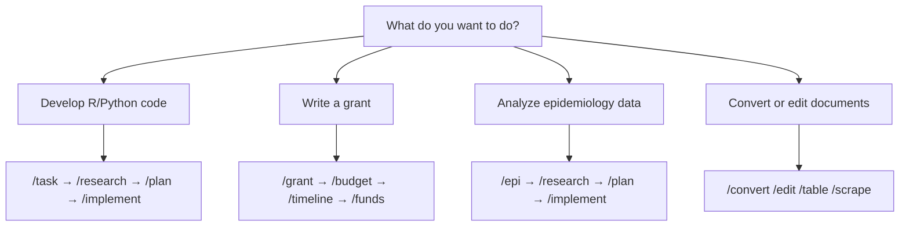

# Research Report: Task #33 — Teammate B Findings

**Task**: 33 — Improve README.md and supporting documentation
**Role**: Teammate B — Alternative Documentation Approaches / Prior Art
**Started**: 2026-04-11T00:00:00Z
**Completed**: 2026-04-11T00:30:00Z
**Effort**: ~1.5 hours research
**Sources/Inputs**: docs/ tree (agent-system/, workflows/), examples/ READMEs, root README.md
**Artifacts**: This report

---

## Key Findings

### 1. The documentation already has good bones — the problem is entry-point design

The existing documentation is well-structured and cross-linked. `commands.md` is a thorough 25-command catalog. `agent-lifecycle.md` is a clean state-machine tutorial. `grant-development.md` and `epidemiology-analysis.md` are clear, decision-table-led guides.

The **gap is not missing content** — it is that the root `README.md` presents the system as "R and Python development with Claude Code" and treats grants/epi/slides as secondary "domain extensions." A researcher who wants to write a grant or run an epidemiology study has to read past language-server configuration and shortcut tables before reaching the agent system description. The entry point is misaligned with the user's actual goals.

### 2. The command catalog is invisible from the README

The root README has a two-table command summary (core + "also available" extensions), but the split buries the most distinctive capabilities. A casual reader sees a table of 6 core commands, a table of 6 extension commands, and moves on. The forcing-questions pattern (the main UX innovation), team mode, multi-task syntax, `--remember`, and the checkpoint lifecycle are not mentioned at all in the README. These are the differentiators that distinguish this system from a simple AI chat.

### 3. The architecture page describes skill composition in natural language — a hidden power feature

`docs/agent-system/architecture.md` contains a compelling section ("Skills as keywords vs commands as workflows") explaining that users can chain multi-step workflows in a single prompt using skill keywords. This is buried at the end of an advanced reference document. It belongs in a "Tips" or "Power User" section of the README.

### 4. Examples are present but presented as technical references, not use-case demonstrations

`examples/epi-study/README.md` and `examples/epi-slides/README.md` are excellent — they show concrete outputs, provide reproducible scripts, and document the four-command workflow step by step. However, the root README mentions them in two lines with a table that reads like a changelog entry. Neither example README tells the user "this is what you can do too, and here is how to start."

### 5. The documentation has no audience-specific entry points

All documentation starts from the same root: "R and Python development with Zed." There is no path for:
- "I am an epidemiologist who wants to analyze my cohort data in R"
- "I need to write an NIH R01"
- "I want to prepare a conference talk from a paper I have"
- "I inherited some R code and want Claude to help me fix it"

CLI tools that do this well (Docker, GitHub CLI, Homebrew) provide multiple "getting started" paths and explicit "if you want to X, start here" navigation anchors.

---

## Recommended Approaches

These are distinct alternatives (not a single recommendation). The planning phase should choose among them.

---

### Approach A: Audience-First Entry Points (Recommended)

**Pattern**: "Getting Started" guides per persona, each linking into the existing deep documentation.

**What this looks like**:

Create a new `docs/getting-started/` directory with 3-4 short files:

```
docs/getting-started/
├── for-researchers.md        # /epi, /grant, /slides, /funds
├── for-r-python-devs.md      # /task + lifecycle, /review, /fix-it
├── for-grant-writers.md      # /grant, /budget, /timeline, /funds
└── index.md                  # picker: "which one are you?"
```

Each "getting started" file follows a simple 3-part structure:
1. **"Here is what this looks like"** — one concrete worked example (can link to `examples/`)
2. **"The two or three commands you need first"** — minimal footprint, not all 25
3. **"Where to go next"** — link to the deep documentation

The root README gets a prominent "Getting Started" section replacing the current "Quick Start" (which is installation-only) that asks: "What do you want to do?" with three links to the persona guides.

**Precedent**: GitHub CLI (`gh`) has separate "getting started" guides for contributors vs maintainers vs CI/CD. Docker has separate guides for developers vs operators. Homebrew has separate paths for installing vs contributing vs formulas.

**Effort**: Medium. Mostly new writing, minimal restructuring.
**Risk**: Low — does not touch existing files.

---

### Approach B: Capabilities Overview Page

**Pattern**: A single "what can this do?" page that replaces the scattered extension descriptions.

**What this looks like**:

Create `docs/capabilities.md` (or `docs/what-can-this-do.md`) structured as:

```markdown
## Core: Structured AI-assisted development
> /task, /research, /plan, /implement, /todo

Any code or document task can be tracked, researched, planned, and implemented
with a consistent checkpoint lifecycle and git commit trail.

## Research & Grants
> /grant, /budget, /funds, /timeline, /slides

End-to-end grant development from funder analysis to narrative drafts...

## Epidemiology & Statistical Analysis
> /epi + standard lifecycle

R-based study design with structured forcing questions that lock in
study design, causal structure, and reporting requirements before work begins...

## Document & Office Workflows
> /convert, /edit, /table, /scrape

Convert, edit, and extract from PDF, DOCX, XLSX, and PPTX...

## Persistent Memory
> /learn, --remember

Cross-session knowledge vault...
```

The root README links here as "Full capabilities" rather than trying to summarize everything in two tables.

**Precedent**: Homebrew's documentation site has a "What Does Homebrew Do?" overview before splitting into sub-sections. Vercel's docs have a "Platform Overview" before feature-specific sections.

**Effort**: Low. Mostly reorganizing existing content into a new file.
**Risk**: Low.

---

### Approach C: Visual Command Map

**Pattern**: A flowchart or decision tree embedded in the README that shows the command system spatially.

**What this looks like**:

A Mermaid diagram in the README (Mermaid renders on GitHub):



This surfaces the breadth of the system in a single glance and provides routing without requiring the user to read through prose.

**Precedent**: Docker Compose docs use a flow diagram to show service dependency graphs. The GitHub Actions documentation uses a workflow diagram to explain triggers, jobs, and steps. The Claude Code architecture page (`docs/agent-system/architecture.md`) already has an ASCII command/skill/agent pipeline diagram — this extends that pattern outward to the user-visible command level.

**Effort**: Very low. A single Mermaid block or ASCII diagram.
**Risk**: Very low. Additive only.

---

### Approach D: Progressive Disclosure via Collapsible Sections

**Pattern**: The README retains its current structure but uses GitHub's `<details>` HTML tag to progressively disclose advanced content.

**What this looks like**:

The current README command table stays, but a `<details>` block below it expands to show: multi-task syntax, team mode, forcing questions, checkpoint lifecycle, the full 25-command list, and cross-links to the workflow guides.

**Precedent**: Many large GitHub repository READMEs (e.g., `rust-lang/rust`, `microsoft/vscode`) use collapsible sections for installation notes, platform details, or contributing guides.

**Effort**: Very low. HTML wrapper additions only.
**Risk**: Very low. Fully additive.

---

### Approach E: Domain-Specific Workflow READMEs Promoted to Root Navigation

**Pattern**: Elevate `docs/workflows/grant-development.md` and `docs/workflows/epidemiology-analysis.md` to first-class entries in the root README's documentation table.

Currently the root README documentation table lists seven rows but does not include any of the workflow guides directly — they are reached via [Workflows](docs/workflows/README.md). This means grant writers and epidemiologists have to navigate two levels (README → Workflows index → specific guide) to find their starting point.

**What this looks like**:

Expand the root README's documentation table to include direct links:

| Document | Description |
|----------|-------------|
| [Epidemiology Analysis](docs/workflows/epidemiology-analysis.md) | Design and run R-based epi studies with `/epi` |
| [Grant Development](docs/workflows/grant-development.md) | Proposals, budgets, funding analysis, slides |

**Effort**: Minimal. Table additions only.
**Risk**: Minimal.

---

## Evidence / Examples

### What the examples/ demonstrate (and don't leverage)

`examples/epi-study/README.md` is a genuinely strong artifact. It:
- Shows concrete output (OR = 3.29, 95% CI 1.57-6.89)
- Provides step-by-step reproducibility instructions
- Includes a directory layout that matches what any `/epi` run produces
- Names all four workflow commands in order with their inputs and outputs

`examples/epi-slides/README.md` similarly shows:
- Talk mode selection (CONFERENCE, 18 min, 14 slides)
- Source material tracing (every table back to a canonical file)
- A complete slide map with timing

Neither README is written to say "you can do this too." Both are documented as frozen snapshots. Reframing them as "quickstart templates" (with a one-paragraph "to start your own, do X" section) would let the root README point to them as substantive entry points rather than references.

### What well-documented CLI tools do differently

| Tool | Pattern | Applicable here? |
|------|---------|-----------------|
| GitHub CLI (`gh`) | "Getting Started" separate from reference | Yes — audience guides |
| Docker | Persona-based entry: developer / operator | Yes — researcher / developer / grant writer |
| Homebrew | "What Homebrew does" overview before features | Yes — capabilities overview page |
| kubectl | Command grouped by concept, not alphabetically | Already done in commands.md |
| Vercel | "Platform overview" diagram before detailed docs | Yes — visual command map |

The common pattern across all of them: **separate orientation from reference**. Users are oriented first (what is this, who is it for, where do I start), then they find their reference material (flags, edge cases, architecture). This project's `docs/` directory has excellent reference material. It is weak on orientation.

### The task management workflow as the core story

The task management workflow (`/task` → `/research` → `/plan` → `/implement` → `/todo`) is both the core of the system and the most transferable concept. It applies to every domain: code, grants, epi studies, slide decks. Every domain-specific command (`/epi`, `/grant`, `/slides`) ultimately feeds into this same lifecycle. The README currently describes this lifecycle once, briefly, in the "Claude Code Commands" section, without naming it as the organizing spine of the system.

A documentation architecture that puts the **lifecycle as the core story** — and shows how each domain extension plugs into it — would be both more accurate and more compelling.

---

## Confidence Levels

| Finding | Confidence |
|---------|-----------|
| Entry point is misaligned for research/grant users | High |
| Command catalog is under-surfaced in README | High |
| Examples could serve as "quickstart" entry points | High |
| No audience-specific navigation exists | High |
| Visual diagram would improve orientation | Medium |
| Progressive disclosure approach would help | Medium |
| Capabilities overview page approach | Medium |
| Skill composition (natural language) feature is hidden | Medium |

---

## Appendix: Documentation Inventory Consulted

- `/home/benjamin/.config/zed/README.md` — root README
- `/home/benjamin/.config/zed/docs/README.md` — docs index
- `/home/benjamin/.config/zed/docs/agent-system/README.md` — agent system overview
- `/home/benjamin/.config/zed/docs/agent-system/commands.md` — full command catalog (25 commands)
- `/home/benjamin/.config/zed/docs/agent-system/architecture.md` — three-layer pipeline + skill composition
- `/home/benjamin/.config/zed/docs/agent-system/context-and-memory.md` — memory layers
- `/home/benjamin/.config/zed/docs/workflows/README.md` — workflows index
- `/home/benjamin/.config/zed/docs/workflows/agent-lifecycle.md` — lifecycle narrative
- `/home/benjamin/.config/zed/docs/workflows/grant-development.md` — grant workflow guide
- `/home/benjamin/.config/zed/docs/workflows/epidemiology-analysis.md` — epi workflow guide
- `/home/benjamin/.config/zed/examples/epi-study/README.md` — synthetic RCT walkthrough
- `/home/benjamin/.config/zed/examples/epi-slides/README.md` — conference talk walkthrough
